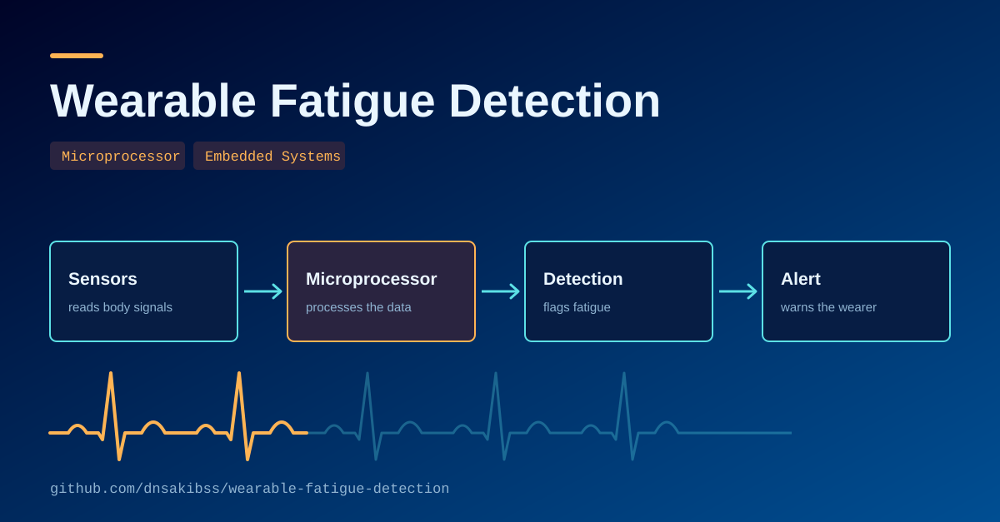

# Wearable Fatigue Detection System
<p align="center">
  
</p>

A compact ESP32-based wearable that combines PPG (MAX30102), motion (MPU6050), and single-lead ECG (AD8232) sensing with on-device R-peak detection and a machine learning pipeline to classify worker fatigue in real time.

Built as a course/capstone project at the Department of Computer Science, American International University-Bangladesh.

## System overview

- **ESP32** samples all three sensors directly over native 3.3V I2C/ADC (no level-shifting hardware needed)
- **ECG R-peak detection** runs on-device with an adaptive baseline filter (~250 Hz target sampling)
- **Ground-truth labeling** via a physical push-button the wearer presses during self-reported fatigue moments
- **Local alerts** via buzzer/LED; **cloud telemetry** via WiFi to ThingSpeak/Firebase, with optional Telegram alerts
- **ML pipeline** (Python/scikit-learn) trains Logistic Regression, Random Forest, HistGradientBoosting, and SVM classifiers on episode-grouped data to avoid train/test leakage

See [`diagrams/hardware_diagram.pdf`](diagrams/hardware_diagram.pdf) for the full hardware wiring and [`diagrams/hardware_implementation.pdf`](diagrams/hardware_implementation.pdf) for a photo of the physical build.

## Repository structure

```
diagrams/
  hardware_diagram.pdf           # full hardware wiring diagram
  hardware_implementation.pdf    # photo of the physical prototype, components labeled
  system-architecture.svg        # data flow / system architecture
  workflow.png                   # on-device sensing -> alert -> logging workflow
docs/
  paper.pdf                      # project writeup
firmware/
  wearable_fatigue_detection/
    wearable_fatigue_detection.ino   # ESP32 sketch (Arduino IDE)
  secrets.h.example                  # template for WiFi/cloud credentials - copy to secrets.h
ml/
  train_fatigue_model.ipynb          # full training pipeline (Colab-ready)
  train_fatigue_model_local.py       # local/non-Colab equivalent
  fatigue_maes.ipynb                 # exploratory/analysis notebook
  fatigue_maes.ipynb - Colab.pdf     # rendered export of the above, with outputs
  all_sensors_data_2.csv             # example session log (1Hz summary)
  ecg_raw_data_2.csv                 # example session log (raw ECG waveform)
.gitignore
README.md
```

## Hardware

| Component | Role |
|---|---|
| ESP32 DevKit (30-pin) | Main microcontroller, WiFi |
| MAX30102 | Heart rate (PPG) + skin temperature |
| MPU6050 | Motion/accelerometer |
| AD8232 | Single-lead ECG + heart rate variability |
| Push button | Ground-truth fatigue labeling |
| LED + buzzer | Local alert |

Full pin mapping and wiring is in [`diagrams/hardware_diagram.pdf`](diagrams/hardware_diagram.pdf); see [`diagrams/workflow.png`](diagrams/workflow.png) for the end-to-end sensing/alert/logging flow.

## Setup

### Firmware
1. Open `firmware/wearable_fatigue_detection/wearable_fatigue_detection.ino` in Arduino IDE (Arduino requires the sketch folder name to match the `.ino` filename, hence the nested folder)
2. Install required libraries: `MAX30105` (SparkFun), `Adafruit MPU6050`, `Adafruit Unified Sensor`, `ArduinoJson`, `WiFiClientSecure` (bundled with ESP32 core)
3. Copy `firmware/secrets.h.example` to `firmware/wearable_fatigue_detection/secrets.h` and fill in your WiFi SSID/password and (optionally) ThingSpeak/Firebase/Telegram credentials **secrets.h is gitignored and never committed**
4. Select board: ESP32 Dev Module, select the correct COM port, upload

### ML pipeline
1. Open `ml/train_fatigue_model.ipynb` in Google Colab (or run `ml/train_fatigue_model_local.py` locally with `pip install pandas numpy scikit-learn scipy matplotlib joblib`)
2. Upload your own session logs, or try the included example session (`ml/all_sensors_data_2.csv` + `ml/ecg_raw_data_2.csv`), produced by the firmware's serial logging
3. Run all cells — produces trained models, confusion matrices, ROC/PR curves, and feature importance plots
4. `ml/fatigue_maes.ipynb` (with its rendered PDF export alongside it) contains additional exploratory analysis on the same data

## Results

Trained on a 35.2-minute single-subject session (2,004 rows, 47 button-marked fatigue episodes), evaluated on held-out episodes (episode-level split to prevent leakage):

| Model | Precision | Recall | F1 | Accuracy | ROC-AUC |
|---|---|---|---|---|---|
| **Random Forest** | 0.767 | 0.805 | **0.786** | 0.905 | 0.939 |
| Logistic Regression | 0.661 | 0.902 | 0.763 | 0.879 | 0.957 |
| SVM | 0.680 | 0.622 | 0.650 | 0.855 | 0.879 |
| HistGB | 0.647 | 0.134 | 0.222 | 0.797 | 0.931 |

Random Forest gave the best held-out balance of precision/recall. HistGB had the best cross-validation score but generalized poorly, indicating overfitting on this small single-subject dataset.

## Known limitations

- Single subject, single 35-minute session generalizability across people/sessions is untested
- Ground truth is self-reported (button press), not a clinically validated fatigue measure
- Predictions were dominated by PPG heart rate features; ECG and motion contributed comparatively little
- ECG sampling achieved ~43 Hz in practice (target was ~250 Hz) due to WiFi/I2C loop overhead — sufficient for heart rate, a real limitation for high-precision HRV
- On-device alert threshold is a fixed rule, independent of and not validated against the trained classifier

See the full project writeup in `docs/paper.pdf` for complete methodology and discussion.
